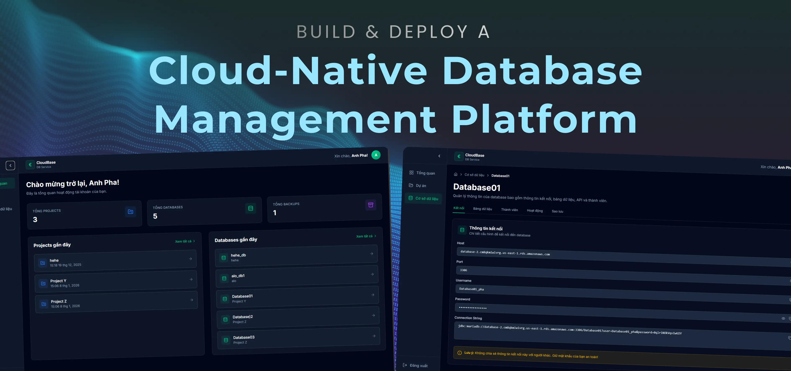

   
  
    

  
  
  
  
  
  
  
  

  <h1>CloudBase</h1>
  <h3>Cloud-Native Database Management Platform</h3>

  

    CloudBase is a cloud-native Database-as-a-Service (DBaaS) platform
    for provisioning, managing, and operating multi-tenant databases
    on AWS with a strong focus on scalability, security, and automation.
  

---

## 📌 Overview

CloudBase enables users to manage projects, provision databases, control access,
and perform backups through a centralized cloud dashboard built on AWS best practices.

---

## 🧱 System Architecture (AWS)

### Key Characteristics

- Multi-AZ VPC architecture
- Public subnets for ALB, NAT Gateway, Bastion Host
- Private subnets for backend services and databases
- Auto Scaling Group for backend services
- S3 for static frontend hosting and database backups

---

## 🛠️ Technology Stack

### Frontend
- ReactJS
- Axios
- Tailwind CSS
- Deployed on Amazon S3 (Static Hosting)

### Backend
- Spring Boot
- RESTful APIs
- JWT Authentication
- EC2 Auto Scaling Group

### Infrastructure
- AWS VPC (Multi-AZ)
- Application Load Balancer
- NAT Gateway
- Bastion Host
- MariaDB / MySQL
- Amazon S3 (Frontend & Backups)

---

## ✨ Core Features

- Authentication & Authorization
- Project & Database Management
- Database Member Invitation & Role Control
- Backup, Restore & Audit Logs
- Table & Data Management
- SQL Import & Export

---

## 👥 Contributors

| Name          | Role       | GitHub                                       |
| ------------- | ---------- | -------------------------------------------- |
| Pham Anh Pha  | Frontend & Cloud Architecture | [@anhphapap](https://github.com/anhphapap)   |
| Nguyen Ho Vu  | Backend & Cloud Architecture | [@hoofdux243](https://github.com/hoofdux243) |

---

## 📄 License

This project is developed for educational and cloud learning purposes.
